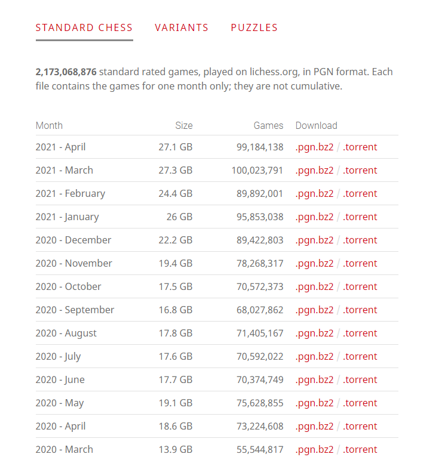
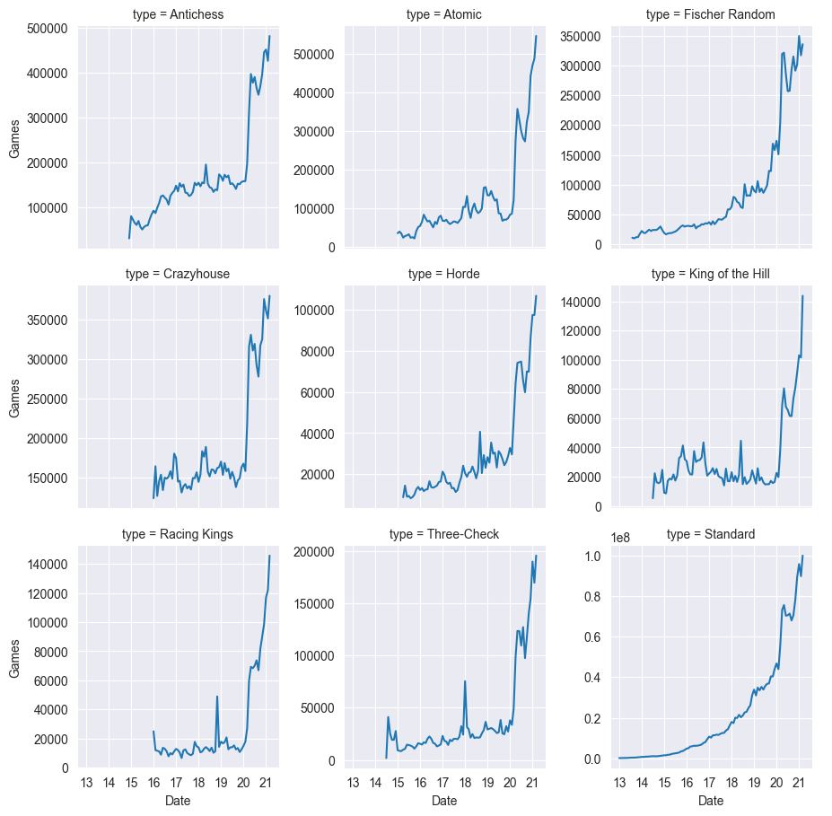
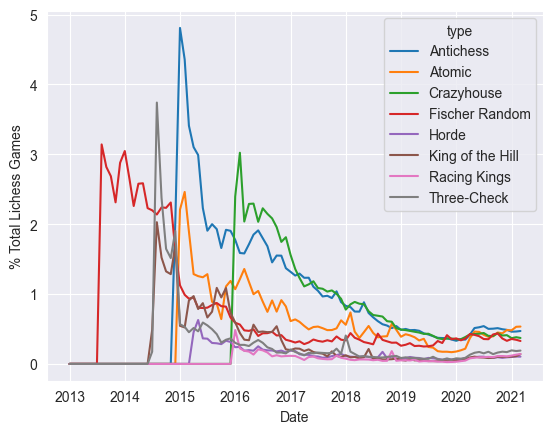
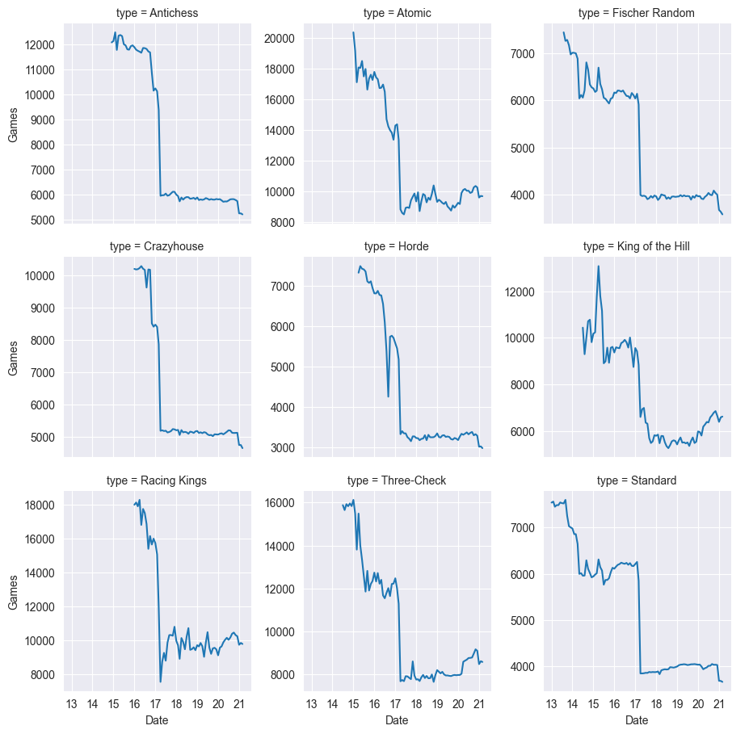

## ***"The ability to play chess is the sign of a gentleman. The ability to play chess well is the sign of a wasted life".*** 

**This sentiment, often attributed as a quotation by Paul Morphy, is probably all the more accurate today. Whereas Morphy's contemporaries would have had to travel miles to neighboring villages or cities to find suitable opponents, today this inconvenience is all but negated by virtue of our technological advancements. Online chess servers, such as lichess and chess.com when combined with the ubiquity of affordable mobile devices and wireless networks mean a real human opponent is y always available to play.**

**Subsequently, we arrive at the following corollary to Murphy's statement: Although the chess player's life may have been wasted, at least his efforts have been meticulously recorded and archived for posterity - by his online chess platform of choice.**

On a personal level, over the past couple years I've seemingly allocated a fair portion of my time (\$ \\approx \\frac{1}{24}\$ -- an hour a day!) to playing blitz chess, according to the stats page of my profile --amounting to roughly 9000 individual games. If the average online chess player is anything like me, there must subsequently be tons of game and meta-data being produced daily -- if these were available, one can imagine there could be numerous interesting questions to investigate..

Indeed, this is the case: complete records of every game played on the lichess plarform are publicly available to download. These records include not only the chess moves, but also a plethora of meta-data: score, ELO ratings, time, player names & colours, openings, move times.. enough to make a data scientist start foaming at the mouth (although, probably only those who are also willing to spend significant portions of their time plaing chess....).

Over the coming weeks, I inded to explore this dataset - and in particular, the game metadata - from multiple angles - both from a personal standpoint (analyzing my own performance), and in terms of trends in the general population. But we proceed with any of this analysis, lets briefly glance over the file download tables:

We note this is a monthly time series, with filesize and games played as a features. Additionally, since the same tables are available for each chess *variant* , this enters our dataset as a grouping variable - resulting in a longitudinal, or panel data. What can we read into these numbers?



-   Online chess on the lichess platform is **very** popular

-   Its popularity is increasing

-   We aren't going to be able to load this into my personal laptops memory :'(

Lets bring this into our python environment for closer examination - when did this increase start, and what is the relationship between these other chess variants.

## Data prep

``` Python
import pandas as pd


url = 'https://database.lichess.org/'
dfs = pd.read_html(url)

formats = ['Antichess','Atomic', 'Fischer Random','Crazyhouse','Horde','King of the Hill','Racing Kings','Three-Check','Standard']  #name our variants

for n,i in enumerate(dfs):
    i['type'] = formats[n]
dfs_j= pd.concat(dfs)
```

I was particularly impressed with the ease with which pandas read_html function can be used to bring html tables directly into your environment. With these 7 lines of code, we already have the raw data in a dataframe! Lets quickly take a look at it..

``` text
with pd.option_context('display.max_columns', None):
    print (dfs_j)
    
                Month     Size       Games             Download  Unnamed: 4  \
0        2021 - April  91.6 MB      476364  .pgn.bz2 / .torrent         NaN   
1        2021 - March  92.6 MB      482445  .pgn.bz2 / .torrent         NaN   
2     2021 - February  81.3 MB      426739  .pgn.bz2 / .torrent         NaN   
3      2021 - January  86.1 MB      452061  .pgn.bz2 / .torrent         NaN   
4     2020 - December  77.7 MB      445984  .pgn.bz2 / .torrent         NaN   
..                ...      ...         ...                  ...         ...   
96       2013 - April  21.1 MB      157871  .pgn.bz2 / .torrent         NaN   
97       2013 - March  21.3 MB      158635  .pgn.bz2 / .torrent         NaN   
98    2013 - February  16.4 MB      123961  .pgn.bz2 / .torrent         NaN   
99     2013 - January  16.1 MB      121332  .pgn.bz2 / .torrent         NaN   
100  Total: 100 files   539 GB  2173068876                  NaN         NaN   
```

Still some way off from being usable - not all columns are needed, the size column has multiple units (MB, GB, kB), the date column has to be loaded as a date type, and each row has a total term. Even the most basic analytic task requires us to fix these issues, and indeed this is the kind of work data scientist can look forward to spending a considerable portion of their time on.

``` Python
dfs_j['DT'] =  pd.to_datetime(dfs_j['Month'], format='%Y - %B', errors='coerce')
dfs_j = dfs_j.dropna(subset=['DT'])
dfs_j['size_num'] = dfs_j['Size'].str.replace('([A-Za-z]+)', '')
dfs_j['size_unit'] = dfs_j['Size'].str.extract('([A-Za-z]+)')

MB_CONVERSION = pd.DataFrame({'unit':['MB','kB','GB'] , 'cf':[1,0.001,1000]})

dfs_j = pd.merge(dfs_j, MB_CONVERSION, how ='left', left_on = 'size_unit', right_on='unit')
dfs_j['size_mb'] = pd.to_numeric(dfs_j['size_num']) * dfs_j['cf']
dfs_j['ngames'] = pd.to_numeric(dfs_j.Games)

dfs_j['compression_ratio']=dfs_j['ngames']/dfs_j['size_mb']
```

Finally, we have a clean workeable dataset. Lets see the raw games played time series...



Looks abit like a wave of COVID infections. We note that t



##### Bonus: Compression Ratio

Since the dataset includes the filesizes, it seems a shame not to do anything with this. I was curious to see how the compression ratio, defined in this instance as games per MB, varied with time. There appears to be a clear structural break in early 2017, which resulted in an 20-50% increase in file size. I am not sure what caused this - perhaps additional metadata was included?



==
